<picture>
  <source media="(prefers-color-scheme: dark)" srcset=".github/assets/fetch-dark.svg">
  <source media="(prefers-color-scheme: light)" srcset=".github/assets/fetch-light.svg">
  
</picture>

## hi, I'm adeildo.

I write software, and sometimes I write about it.

I'm a co-founder and the founding engineer of [Ranqia](https://www.ranqia.ai/), where we build the infrastructure that lets brands shape what LLMs say about them. I study Computer Science at [Insper](https://www.insper.edu.br/), and I collaborate with LABORA at FGV EMAp, a lab for mathematical modeling in epidemiology. I got here from a small town in Alagoas through math olympiads, and [the whole road is on my site](https://adeildo.dev/whoami/).

### what I'm building

- **[whatsapp-mcp](https://github.com/felipeadeildo/whatsapp-mcp)**. Give your AI agents your WhatsApp. An MCP server that reads, searches and sends your messages, running on your own Cloudflare account.
- **[pi-harness](https://github.com/felipeadeildo/pi-harness)**. The extensions I run [pi](https://pi.dev) with: permissions, providers and more, each installable on its own.
- **[repositron](https://github.com/felipeadeildo/repositron)**. A typed, generic repository base for SQLAlchemy 2.0. Full CRUD, zero per-table boilerplate.
- **[regbr2cf](https://github.com/felipeadeildo/regbr2cf)**. A CLI to move registro.br domains to Cloudflare nameservers in bulk.
- **[dms-music-theme](https://github.com/felipeadeildo/dms-music-theme)**. A DankMaterialShell plugin that tints the system theme to match the album art of what's playing.
- **[neural-network](https://github.com/felipeadeildo/neural-network)**. A neural network written from scratch, with the math documented.

### what I'm writing

- [Sim, outro harness de coding agent](https://adeildo.dev/log/yes-another-agent-harness/), on why "giving an LLM tools" was always a regex over text, and the harness I built on top of pi.
- [Leaving Next.js for a SPA and a Worker](https://adeildo.dev/log/migrating-nextjs-application-to-react-router/), on moving an app to React Router and Cloudflare Workers.

More in the [log](https://adeildo.dev/log/), and how my machine is set up in the [wiki](https://adeildo.dev/wiki/).

 

  <a href="https://adeildo.dev">adeildo.dev</a> · <a href="https://linkedin.com/in/felipeadeildo">linkedin</a> · <a href="mailto:blablabla-catch-all-my-friend@felipeadeildo.com">email</a> · <a href="https://adeildo.dev/feed_rss_created.xml">rss</a>

